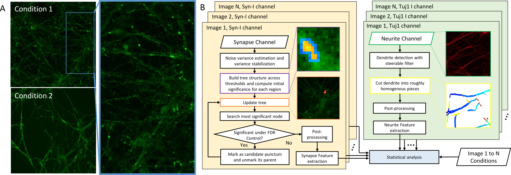

# Welcome to SynQuant
SynQuant is a Fiji plugin that automatically quantify synapses from multi-channel fluorescence microscopy images. 

SynQuant is especially suitable for data with:
1. **Heterogeneous syanspes** with different sizes and brightness.
2. **Imperfect anti-body** that is not always inside the synapes. This may look like some diffusing signals in neurites.

Both synapse and corresponding dendrite are detected. Synapses are detected on synapse channel, where they act as puncta surrounded by highly inhomogeneous interference signals. Dendrite is extracted from the reference dendrite channel.

# Getting started
1. Download the Fiji plugins. For 2D data, download [this](SynQuant_-1.2.jar). For 3D data, download [this](SynQuantVid_-0.0.1-SNAPSHOT.jar).
2. Put the downloaded jar file to the plugin folder of Fiji.
3. Open Fiji and load the data. Then open SynQuant from the plugins menu.

For more details, download our user guide [here](https://drive.google.com/open?id=1NfSYmmijhB1jGlrvVrfiymRMf93GmPSH).

# Example data
Download the example data [here](https://drive.google.com/open?id=1SzF_MH1WfvB3ZRiE6jyYaoaHuc1nrhul).

# Algorithm overview
SynQuant detect synapses through a totally unsupervised probability principled framework. In this framework, analysis is conducted on salient regions rather than pixels. All synapse candidates are scored by their own local contrast and compared fairly with each other. What’s more, false discover rate (FDR) control is utilized to determine synapse selection, which not only controls the false positive rate but also provides a statistical evidence of the detected synapse. The parameter used in this framework is only the value of FDR which is easy to tune. The framework of synapse detection algorithm now is based on the idea of component tree. SynQuant extracts dendrite by steerable filter. Extracted dendrite then are segmented into roughly homogeneous pieces by branch points and end points. Based on the dendrite pieces and synapses, linear regression is used to find the effects of dendrite’s properties to the number of synapses on it.

# Updates
* Add the component tree structure for synapse detection suggested by Dr.Petter Ranefall. The version 1.1 now is 3 times faster than before.
* Version 1.2 allows for the detection of pre-, post-synaptic puncta and synaptic sites. It can output ROI regions through ROI manager now and user could save the mask by themselves. The quantification can be done based on detected synapses or synaptic sites.
* Add support for 3D data.

# How to cite
The journal paper is in preparation. You can cite the conference paper first:

Yizhi Wang, Guilai Shi, Yinxue Wang, Lin Tian, Guoqiang Yu*, “PPSD: Probability Principled Synapse Detection,” BioImage Informatics Conference 2015, October 2015.
