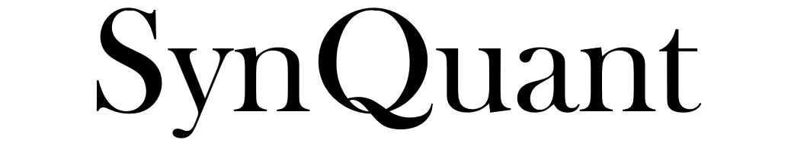
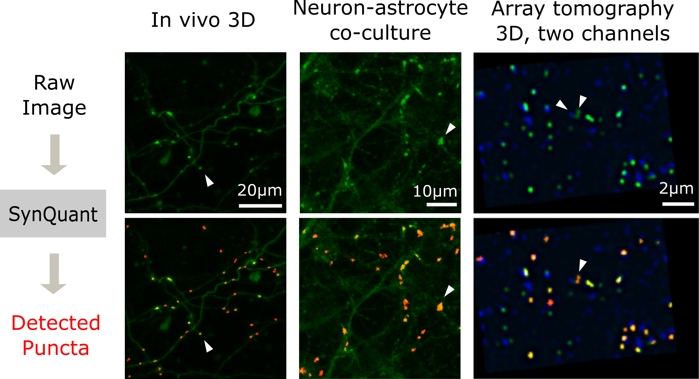
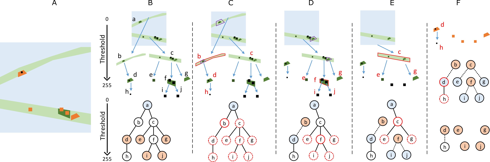

----------------------------------

SynQuant is a Fiji plugin that automatically quantifies synapses from fluorescence microscopy images. If you have any feedback or issues, you are welcome to either post an issue in the Issues section or send an email to yug@vt.edu (Guoqiang Yu at Virginia Tech).

- [Welcome to SynQuant](#Welcome-to-SynQuant)
- [Why SynQuant](#Why-SynQuant)
  - [*Versatile* and works with *difficult* data](#Versatile-and-works-with-difficult-data)
  - [Unsupervised, but works as good as (or better than) supervised methods](#Unsupervised-but-works-as-good-as-or-better-than-supervised-methods)
  - [Statistical significance for each punctum](#Statistical-significance-for-each-punctum)
  - [Easy to use](#Easy-to-use)
- [Getting started](#Getting-started)
- [Images and datasets](#Images-and-datasets)
- [Batch processing](#Batch-processing)
- [Algorithm overview](#Algorithm-overview)
- [Updates](#Updates)
- [Reference](#Reference)

# Welcome to SynQuant
SynQuant is a Fiji plugin that automatically quantify synapses from fluorescence microscopy images. [Try SynQuant Now!](#Getting-started)

Any problem? SynQuant does not work on your data? 
Please open an issue. We are happy to help!

# Why SynQuant

## *Versatile* and works with *difficult* data
* **Detect** and **segment** synaptic punctum
* **2D** and **3D** data
* **Confocal** imaging, **two-photon** imaging, and **array tomograhy**
* **Cultured** tissue, **brain slice**, and **in-vivo** data
* Combine **pre-synaptic and post-synaptic chanenls** to predict the ground-truth synaptic cleft
* With or without **neurite comtamination** 
* Puncta may have different **sizes**, **shapes** and **brighness**

## Unsupervised, but works as good as (or better than) supervised methods
* SynQuant performs better than peer unsupervised methods [5-8] for all the three data sets we tested (3D *in-vivo* [2], array tomography [3], neuron-astrocyte coculture [4]).
* SynQuant is performs similar with the best performing supervised method [10] in terms of F1 score and works better than it in terms of average precision.
* SynQuant outperforms other supervised methods [9,11].
<!-- * Training an supervised methods is non-trivial: sufficient training labels, experimenting with all kinds of network architectures or feature extraction algorithms, and somehow boring parameter tuning.  -->
<!-- * **We suggest trying SynQuant on your data before using the supervised methods**. -->

## Statistical significance for each punctum
* SynQuant is based on order statistics, which assign a p-value or z-score to each puncta. 
* Adjust z-score to trade-off between false positives and false negatives.

## Easy to use
* User friendly Fiji plug-in
* Export detected puncta to ROI manager
* For 2D image, SynQuant can trace neurites as well
* Coming soon: Have lots of images? It is easy to to call the Java class of SynQuant in your MATLAB code.

<!-- # Getting started
1. Download the Fiji plugin [here](https://github.com/yu-lab-vt/SynQuant/releases).
2. Put the downloaded jar file to the plugin folder of Fiji.
3. Open Fiji and load the data. Then open SynQuantVid from the plugins menu.

For more details, download our user guide [here](https://drive.google.com/file/d/1YND2SoC8yUhU6LBVBY-8TO1Wul8f0TnO/view?usp=sharing). -->

# Getting started
1. [Downlaod SynQuant](https://github.com/yu-lab-vt/SynQuant/releases). 
    * If you do not have Fiji yet, get it [here](https://fiji.sc/).
2. Put the downloaded jar file to the `plugin` folder of Fiji.
3. Open Fiji and load the image. 
4. Open `SynQuantVid` from the `plugins` menu.
5. Check out the [user guide](https://drive.google.com/file/d/17e56-Go4kkm6A6cvvN1lt57hN85hu8K5/view?usp=sharing).
6. Check out the [Simple Video Demo](https://drive.google.com/file/d/1nVMPiRUjSMq6acZgAvoXQvqYLPtUnC4w/view?usp=sharing).

# Images and datasets
## Example images
Example data for testing the SynQuant plugin can be found [here](https://drive.google.com/drive/folders/1IZS_1Vp3o54NBx0doTdjhUTt_hvUxi9b?usp=sharing).

## Synthetic and real data used in the paper
Click [here](https://github.com/yu-lab-vt/SynQuant-data) to get the following things related to the experiments in [1]:
* Three real data sets and labels
* Synthetic data with labels
* Description of real and synthetic data
* Code to generate synthetic data

# Algorithm overview
SynQuant detects synapses through an unsupervised probability principled framework. In this framework, analysis is conducted on salient regions rather than pixels. 

All synapse candidates are scored by order statistics which combine the information of size, local contrast, and noise level. What’s more, p-value or z-score to determine synapse selection, which provides statistical evidence of the detected synapse. 
The parameter used in this framework is only the threshold of p-value or z-score which is statistically meaningful and easy to tune. 

The framework of the synapse detection algorithm now is based on the idea of the component tree which scales well to 3D data. 

For more information, check out our [paper](https://academic.oup.com/bioinformatics/article/36/5/1599/5584198). For citation, see reference [1].

# Batch processing
For processing large amounts of data, you may wish to write some scripts in ImageJ. Another choice is to call SynQuant Java classes directly from MATLAB. An example is given [here](https://github.com/freemanwyz/SynQuant_MATLAB_Java). Note that this only contains a subset of the features of the Fiji plug-in, and does not provide a GUI. For a smaller amount of images, it is better to use the Fiji plug-in.

You may also try to call SynQuant using the Python-ImageJ interface [PyImageJ](https://github.com/imagej/pyimagej), but we have not tested that yet.

# Updates
Version 1.2.8 [7/30/2020]
* Fixed the bug that SynQuant can’t get any result when the input images don’t contain any noise.

Version 1.2.7 [7/3/2020]
* When users open SynQuant without any valid image, it will give users a notification.

Version 1.2.6 [6/11/2020]
* Add extending distance for the "intersect" channel combination method.

Version 1.2
* Allow for the detection of pre-, post-synaptic puncta and synaptic sites.
* Add the function of combining pre-, post-synaptic puncta detection results.
* Support of puncta detection for both 2D and 3D data in the same plugin.
* Add one more noise estimation/stabilization method.
* Add two more input parameters for the user to tune their targets' shapes.
* Add a slider for the user to post-process results based on the z-score.

Version 1.1
* Add the component tree structure for synapse detection suggested by Dr.Petter Ranefall. 3 times faster than before
* Output ROI regions overlaid with original synaptic data. Quantification can be done based on detected synapses or synaptic sites.

# Reference
## Citation
[1] Yizhi Wang*, Congchao Wang*, Petter Ranefall, Gerard Joey Broussard, Yinxue Wang, Guilai Shi, Boyu Lyu, Chiung-Ting Wu, Yue Wang, Lin Tian, Guoqiang Yu. (2020). SynQuant: An Automatic Tool to Quantify Synapses from Microscopy Images, Bioinformatics, 36(5), 1599–1606

## Dataset related papers
[2] Bass, C., Helkkula, P., De Paola, V., Clopath, C., & Bharath, A. A. (2017). Detection of axonal synapses in 3d two-photon images. PloS one, 12(9).

[3] Collman, F., Buchanan, J., Phend, K. D., Micheva, K. D., Weinberg, R. J., & Smith, S. J. (2015). Mapping synapses by conjugate light-electron array tomography. Journal of Neuroscience, 35(14), 5792-5807.

[4] Mizuno, G. O., Wang, Y., Shi, G., Wang, Y., Sun, J., Papadopoulos, S., ... & Bhattacharyya, A. (2018). Aberrant calcium signaling in astrocytes inhibits neuronal excitability in a human Down syndrome stem cell model. Cell Reports, 24(2), 355-365.

## Peer methods: unsupervised
[5] Zhang, B., et al. (2007) Multiscale variance-stabilizing transform for mixed-Poisson-Gaussian processes and its applications in bioimaging. Image Processing, 2007 IEEE International Conference on, VI-233-VI-236.

[6] Rezatofighi, S., et al. (2012) A new approach for spot detection in total internal reflection fluorescence microscopy. Biomedical Imaging (ISBI), 2012 9th IEEE International Symposium on, 860-863.

[7] Schmitz, S., et al. "Automated analysis of neuronal morphology, synapse number and synaptic recruitment." Journal of Neuroscience Methods 195 (2011): 185-193.

[8] Simhal, AK., et al. "Probabilistic fluorescence-based synapse detection." PLoS Computational Biology 13.4 (2017).

## Peer methods: supervised
[9] Bass, C., Helkkula, P., De Paola, V., Clopath, C., & Bharath, A. A. (2017). Detection of axonal synapses in 3d two-photon images. PloS one, 12(9).

[10] Kulikov, V., Guo, S. M., Stone, M., Goodman, A., Carpenter, A., Bathe, M., & Lempitsky, V. (2019). DoGNet: A deep architecture for synapse detection in multiplexed fluorescence images. PLoS Computational Biology, 15 (5).

[11] Ronneberger, O., et al. "U-net: Convolutional networks for biomedical image segmentation." International Conference on Medical image computing and computer-assisted intervention. Springer, Cham, 2015.

